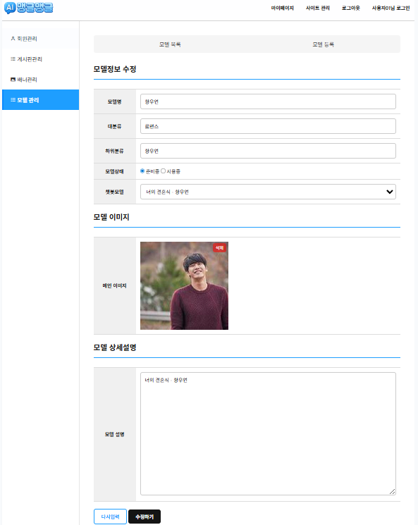

# 맹글맹글 프로젝트

### ➡️ 개요
- 자연어 처리 AI를 활용하여 채팅을 주고 받을 수 있는 서비스를 제공합니다.
- 전이 학습을 통해 모델마다 특성을 부여하여 대화하는 모델마다 색다름을 제공합니다.
- 대화 내역은 게시판에 기재하여 다른 사람과 공유할 수 있습니다.
- 댓글을 통해 게시글에 자신의 의사를 표현할 수 있습니다.

### 🕹️ 역할 분담
- 김문수 : 멤버 도메인, 보안 공통 설정, 편의
- 주용현 : 마이페이지 도메인, 파일 관리 공통 작업, 챗봇 도메인
- 주예성 : 게시판 공통 작업, 관라자 멤버 도메인
- 이소민 : 파일 관리 공통 작업, 메인 도메인
- 오경석 : 파일 관리 공통 작업, 프로덕트(상품) 도메인
- 송근호 : 프로덕트(상품) 도메인
  
---

### 🟨 김문수

### ➡️ 기능 설명
- 보안 공통 설정 : 회원 별 권한에 따른 접근 가능한 페이지 구분, 로그인 시 검증, 로그 아웃 등
- 멤버 도메인 

    - 회원 가입
      
      회원 가입 시 필요한 정보를 폼으로 입력받음  
      입력한 정보 검증 성공 시 DB에반영 (실패 시 실패 사유 표기)  
      REST API를 활용한 소셜 연동 회원 가입(KAKAO, NAVER)

    - 이메일 인증
      
      회원 가입 및 계정 찾기에서 이메일을 통한 계정 관리 서비스  
      회원 가입 시 실제로 존재하는 이메일을 입력했는지 인증 메일을 통해 검증  
      계정 분실 시 이메일을 통해 아이디 검색, 비밀번호는 초기화하여 새로 발급한 비밀번호를 이메일로 전송  
      
    
    - 로그인
      
      DB내 회원 여부를 확인하고 로그인 처리  
      일반적인 회원 가입 시 userId(로그인 시 사용)로 구분  
      소셜 연동 회원의 경우 소셜 계정 정보를 social_token(연동 가입시 부여)로 구분

### ➡️ 코드 리뷰

- `SecurityConfig` : 로그인, 로그 아웃, 접근 권한 설정, 비밀 번호 BCrypt를 사용하여 해시화  
- `MessageSourceConfig` : 메시지 처리를 위한 공통 설정, 메시지 유지 보수 관리에 용이하기에 채택  
- `InterceptorConfig` : CommonInterceptor을 선언하여 소셜 토큰, 로그인 여부, 권한 등의 정보를 반영  

- `MemberController` : 사용자 요청 시 멤버 도메인 내 매핑을 일괄 담당  
  - 일반 회원 가입 및 로그인 절차 리뷰 참고 자료  
    https://gitmind.com/app/docs/fv08jdn7
- `Validator` : 회원 가입, 로그인, 계정 찾기 시 검증 절차

### ✅ 구현 이미지

☑️ 회원 가입 폼  

  
  

  
 
☑️ 이메일 인증  
 

  
  
  

   
☑️ 로그인  
   

  
  
  

 
☑️ 아이디 비밀번호 찾기  
   

  
  

 

  
  
  

 

---

### 🟨 주용현

### ➡️ 기능 설명
- 로그인한 회원의 정보를 기반으로 개인화된 마이페이지 제공
  - 주요 기능:
    - 메인 페이지 - 로그인한 사용자의 정보와 최근 게시글 5개 표시
    - 개인정보 수정 - 이름, 성별, 휴대폰 번호, 프로필 이미지 변경
    - 비밀번호 변경 시에는 복잡성 검사 수행
    - 작성한 게시글 조회 - 본인이 작성한 게시글 목록 조회 (페이지네이션 포함)
    - 회원 탈퇴 - 탈퇴 확인 후 회원 삭제 처리
    - 탈퇴 클릭 시 sweetAlert2를 띄어 경고 후 탈퇴 처리
    - 각 메뉴 진입 시 타이틀, 스크립트, 스타일 등을 동적으로 세팅
-  챗봇 서비스
  - 사용자가 선택한 챗봇 모델(ChatbotModel)을 기반으로 채팅 세션을 관리
  - 채팅방(roomId)을 생성하거나 기존 방으로 입장 가능
  - 사용자의 메시지를 받고 AI 챗봇 API에 메시지를 전송하여 응답 수신
  - 사용자 메시지 및 챗봇 메세지, 감정 정보를 DB에 저장
  - 프론트엔드에 필요한 CSS, JS 리소스 동적 추가
- 공통소스 : file
  - [업로드] : FileUploadService → FileInfoService (경로 계산, URL 설정) → DB 저장
  - [삭제] : FileDeleteService → FileInfoService (정보 조회) → File 시스템 + DB 삭제
  - [조회] : FileInfoService 단독 → DB 조회 + 경로/URL 가공
  - [JS 연동] : commonLib.fileManager → Ajax로 /file/upload, /file/delete → 위 서비스들 호출

### ➡️ 코드 리뷰
- MyPageController
  - 마이페이지 전체 기능을 관리하는 컨트롤러
  - 공통 전처리 메서드 commonProcess()페이지 모드에 따라 타이틀, JS, CSS 등을 세팅
  - /mypage 기본 마이페이지로 회원 정보와 최근 게시글(최대 5개)을 조회
  - boardInfoService에 getMyLatest 메서드를 정의하여 limit갯수(5개)만큼 회원이 작성한 최신게시글 가져오기
  - /mypage/profile (GET, PATCH)
  - 프로필 조회 및 수정
  - ProfileValidator를 통해 입력값 유효성 검사
  - 비밀번호는 있을 경우에만 복잡도 및 확인 검사 수행
  - /mypage/board내가 작성한 글을 리스트로 출력 (검색조건 BoardSearch 사용)
  - /mypage/resign회원탈퇴 확인 및 처리 (POST 요청 시 MemberUpdateService.resign() 호출)
- RequestProfile (DTO)
  - 프로필 수정 폼 객체
  - 이름, 성별, 휴대폰 번호, 비밀번호, 프로필 이미지 포함
- ProfileValidator
  - 비밀번호 복잡성 검사 (checkAlpha, checkNumber, checkSpecialChars)
  - 비밀번호 확인 필드 일치 여부 검사
  - 휴대폰 번호 형식 유효성 검사 (checkMobile)
  - 네이버/카카오 로그인은 비밀번호 입력이 없을 수 있음 → 조건부 검사 처리 적절함
 
    
- ChatbotModel (Enum)
  - 챗봇 모델별 번호(num)와 이름(title)을 정의
  - enum 타입으로 각 모델을 구분하여 코드 내 명확성 제공
- ChatController
  - `/chat` 기본 경로에서 챗봇 대화 페이지 노출
  - `index` 메서드: model(enum)과 roomId(옵션)를 받아 세션 생성 및 화면에 전달
  - `chatting` API: 클라이언트 요청으로 받은 메시지와 모델 정보로 서비스 호출 후 결과 반환
  - 요청 파라미터 검증을 위해 `@Valid` 및 `Errors` 사용, 에러 발생 시 커스텀 예외 처리
  - 응답은 JSON 형태로 `ChatData` 엔티티를 그대로 반환
- RequestChat (DTO)
  - 채팅 API 요청 데이터 바인딩용 객체
  - roomId (optional), model(enum, not null), message(not blank) 필드 포함
- ChatData (Entity)
  - 채팅 데이터를 DB에 저장하기 위한 저장용 JPA 엔티티
  - 챗봇 모델, 방 ID, 회원, 사용자 메시지, 챗봇 메시지, 감정 정보 컬럼 정의
  - `@Enumerated(EnumType.STRING)`으로 enum 저장 시 가독성 유지
  - 회원과 연관관계 설정 및 Jackson 직렬화 예외 처리(`@JsonIgnore`)
- ChatDataRepository
  - 기본 CRUD 및 Querydsl 동적 쿼리 지원
- ChattingService
  - 로그인 여부 확인 후 채팅 기록 저장
  - 외부 AI 챗봇 API 호출 (RestTemplate 사용)
  - API URL, 메시지, 모델 번호를 포함한 GET 요청 생성 및 전송
  - 응답에서 시스템 메시지와 감정 정보를 추출해 DB에 업데이트
  - 멤버 정보를 MemberUtil로 가져와 연동
 
- FileInfoService
  - 파일 정보를 조회하고 가공하는 역할을 담당하는 서비스
  - 주요 기능 get(Long seq) → 파일의 고유 번호(seq)로 FileInfo 엔티티 조회 후 URL, 경로, 이미지 여부 등의 부가 정보를 설정
  - getList(String gid, String location, FileStatus status) → 파일 그룹(gid) 및 위치(location)에 따라 필터링된 파일 목록을 조회합니다. FileStatus로 DONE, UNDONE 필터링 가능
  - getFileUrl(FileInfo item) → 브라우저에서 접근 가능한 파일 URL 생성.
  - getFilePath(FileInfo item) → 서버에서의 실제 저장 경로 생성.
  - addInfo(FileInfo item) → 파일 객체에 파일 경로, URL, 이미지 여부, 썸네일 경로 등을 설정합니다.
  - folder(long seq) → 파일 저장 폴더를 0~9 범위로 분산 저장하도록 지정 (seq % 10).
- FileUploadService
  - 파일을 서버에 업로드하고 DB에 기록하는 서비스
  - 주요 기능 uploadProcess(RequestUpload uploadForm)
  - 파라미터에서 gid, location, single, imageOnly 등의 설정값을 추출
  - 유효성 검사 및 옵션에 따라 기존 파일 삭제(single이면 deleteService.process(...))
  - MultipartFile을 지정 폴더에 저장
  - DB에 FileInfo 저장 후 경로 추가
  - processDone(String gid) → 특정 파일 그룹에 속한 파일들을 done = true 상태로 업데이트
  - 특이사항 저장 경로는 basePath/폴더(seq%10)/파일명(seq+확장자) 형태로 지정됨.
  - 실패 시 DB에서 FileInfo 레코드 삭제.
- FileDeleteService
  - 파일을 서버 디스크와 DB에서 모두 삭제하는 서비스
  - 주요 기능 deleteProcess(Long seq)
  - infoService.get(seq)으로 파일 정보 조회
  - File 객체 생성 후 실제 경로에서 파일 삭제
  - DB에서도 삭제 처리
  - process(String gid, String location) → 해당 gid 및 location에 포함된 파일들을 반복적으로 deleteProcess() 호출하여 일괄 삭제 → location이 없으면 전체 gid로 삭제 가능
- [Upload] : FileUploadService → FileInfoService (경로 계산, URL 설정) → DB 저장
- [Delete] : FileDeleteService → FileInfoService (정보 조회) → File 시스템 + DB 삭제
- [조회] : FileInfoService 단독 → DB 조회 + 경로/URL 가공
- [JS 연동] : commonLib.fileManager → Ajax로 /file/upload, /file/delete → 위 서비스들 호출

### ✅ 구현 이미지

---

### 🟨 오경석

### ➡️ 기능 설명
- 공통 소스 pagination, fileDownloadService 구현
-  관리자 페이지에서 챗봇 모델 조회, 검색
-  관리자 페이지에서 챗봇 모델 등록
-  관리자 페이지에서 챗봇 모델 수정 및 삭제

### ➡️ 코드 리뷰
- Admin/Model 도메인은 관리자 페이지에서 AI 챗봇 모델을 관리하기 위해 설계되었다.
- ModelViewService : 조회 전용 서비스
                     조건 조합을 위해 BooleanBuilder 사용
                     이미지 연동을 위해 FileInfoService 사용
- ModelUpdateService : 모델의 등록, 수정, 삭제 처리
- ModelController : 검색 - ModelSearch를 통해 목록을 조
                    등록 - UUID로 랜덤 gid 생성, 기본 상태 READY
                    수정 - seq에 해당하는 모델 정보를 RequestModel로 변환하여 폼에 전달
                    삭제 - 체크박스로 전달된 idx 목록을 받아 soft delete 처리
                           삭제 완료 후 자바스크립트로 부모창 새로고침 처리
- 개선 사항
  - 모델의 카테고리를 입력값으로 받아서 오타나 띄어쓰기가 있을 경우 다른 분류로 인식한다.
    Enum 클래스로 주입받아 카테고리 값을 선택지 중에 고르게 개선할 필요가 있다.

### ✅ 구현 이미지

---

### 🟨 주예성

### ➡️ 기능 설명
- 관리자 페이지 회원 관리 기능
- 관리자 페이지 게시판 관리 기능(게시판 등록, 수정, 삭제)
- 게시판 기능 구현
  - 게시글 쓰기, 수정 및 삭제, 댓글 쓰기, 수정 및 삭제

### ➡️ 코드 리뷰
- Board.java
  - 게시판 종류 자체 정보를 담고있음
  - Authority로 권한 설정 : MEMBER, ADMIN
  - @Transient 필드는 DB 저장 안 됨 → UI에 필요할 때만 사용
  - getCategories() : 줄 바꿈으로 구분된 category 문자열을 리스트로 변환
- BoardData.java
  - 게시판에 작성된 개별 게시글 정보(실제 글 하나)
  - board, member는 외래 키 (@ManyToOne)
- Comment.java
  - 위의 글 들과 구조는 유사함 내용만 다름
- BoradView.java , BoardViewId.java
  - 중복 조회 방지를 위한 ‘게시글 조회 기록’ 엔티티
  - 같은 사용자가 같은 글을 여러 번 조회해도 조회수는 1번만 증가
- BoardController.java
  - 메서드
    - list(), /list/{bid} : 특정 게시판의 글 목록 조회
    - write(), /write/{bid} : 글쓰기 화면
    - update(), /update/{seq} : 게시글 수정
    - save(), /save : 글 저장 처리
    - view(), /view/{seq} : 게시글 상세 보기
    - delete(), /delete/{seq} : 게시글 삭제
    - comment(), /comment : 댓글 저장
    - commentUpdate(), /comment/{seq} : 댓글 수정
    - commentDelete(), /comment/delete/{seq} : 댓글 삭제
  - 공통 처리 메서드
    - commonProcess(String bid, String mode, Model) : 게시판 설정/권한/스타일 처리
    - commonProcess(Long seq, String mode, Model) : 게시글/댓글 정보 및 권한 체크
- BoardRepository.java
  - 전체 조회용 메서드 추가
  - 관리자에서 게시판 관리 시에도 사용됨
- BoardDataRepository.java
  - 글 저장, 조회, 수정, 삭제의 중심
  - BoardListService, BoardUpdateService, BoardInfoService 등 여러 곳에서 사용
- CommentRepository.java
  - 댓글 목록/상세/삭제에 활용
  - CommentInfoService, CommentUpdateService 등에서 사용
- BoardViewRepository.java
  - 조회수 중복 증가를 방지하는 데 사용
  - 사용자의 IP + UA + 회원ID 조합으로 조회 기록 관리
- BoardInfoService.java
  - 게시글 1개 조회 및 조회수 증가 처리
  - BoardDataRepository 사용하여 게시글 조회
  - 내가 쓴 게시글 목록 메서드 사용하여 마이페이지와 연동
  - 권한 체크와 에디터용 첨부파일 처리도 함께 수행
  - 에디터 이미지와 첨부파일 구분
- BoardListService.java
  - 전체 게시판 목록 조회 서비스
  - 화면에서 게시판 리스트 렌더링 시 사용됨
- BoardUpdateService.java
  - 게시글 작성 및 수정 처리
  - RequestBoard를 받아 BoardData로 저장
  - 게시판 설정과 권한 체크, 공지글 설정, 파일업로드 연동 포함
  - memberUtil.isAdmin()으로 공지글 여부 판단
  - 파일 업로드 후 uploadService.processDone(gid) 호출
- BoardDeleteService.java
  - 조회 후 삭제 → flush()까지 호출
- BoardViewCountService.java
  - 게시글 중복 조회 방지를 위한 조회수 증가 처리
  - BoardView저장으로 중복 체크
  - memberUtil.getUserHash()로 사용자 식별
  - BoardViewRepository에 hash + seq 저장 → 중복 조회 방지
  - 총 조회수 카운트 후 BoardData에 저장
- CommentInfoService.java
  - 댓글 1개 조회 / 목록 조회 / 수정 폼 반환
  - QueryDSL로 작성자 정보 함께 조인(fetch join)
  - 댓글 작성자와 현재 로그인한 사용자 비교 후 mine, editable설정
  - 댓글도 작성자 권한 분기 처리됨
- CommentUpdateService.java
  - 댓글 작성 / 수정 처리
  - 댓글 작성자, IP, UA 저장
  - 댓글 수 업데이트까지 처리
  - BoardInfoService로 게시글 가져옴
- CommentDeleteService.java
  - 댓글 삭제 서비스
  - 댓글 1개 조회 후 삭제하고 댓글 수 다시 계산
  - CommentInfoService.get()으로 조회 후 deleteById(seq)
  - 댓글 수 최신화까지 한 번에 처리
- BoardAuthService.java
  - 게시판 접근 권한 체크
  - 게시글 쓰기, 보기, 댓글 권한 → Authority 별로 확인
  - 로그인 여부와 관리자 여부를 조합해서 접근 제어
- BoardConfigInfoService.java
  - 게시판 설정 정보 조회 서비스
  - get(bid)로 게시판 1개, getList()로 목록 조회
  - 게시판 권한에 따라 listable, writeable, commentable 설정
  - QueryDSL로 게시판 검색 필터링 가능
  - 사용자 권한에 따른 접근 가능 여부 세팅
- BoardConfigUpdateService.java
  - 게시판 설정 저장 서비스
  - RequestBoard → Board로 매핑 후 저장
  - 관리자에서 게시판 설정 변경 시 사용됨

### ✅ 구현 이미지

---

### 🟨 이소민

### ➡️ 기능 설명
## 1. 템플릿 및 레이아웃

- 기본 레이아웃(index.html) : header, side, footer 포함
- 콘텐츠 영역(main.html) : 메인 배너 포함
- 공통 영역 분리(outlines)로 재사용성 강화
- `common.js`에서 사이드 메뉴 스크롤 시 위치 조정 처리

## 2. 메인 배너 구성

- 그룹 코드(`mainBanner1`)와 관리자 그룹 코드 일치 필요
- 컨트롤러에서 배너 리스트 모델에 담아 뷰에 전달
- Thymeleaf `th:each`로 반복 출력

## 3. Swiper 슬라이드

- DOMContentLoaded 후 초기화
- loop + autoplay 설정으로 부드러운 슬라이드 구현

## 4. 백엔드 연동

- `MainController`에서 배너 조회 후 모델 전달
- `BannerInfoService`에서 그룹 코드로 배너 조회

## 5. 관리자 배너 관리

- 배너 등록/수정 폼과 목록 페이지 제공
- 가중치, 사용 여부, 링크 등 속성 관리 가능

## 6. 주요 클래스 및 메서드

- `BannerInfoService` : 배너 조회 및 저장
- `MainController` : 메인 페이지 배너 전달
- `BannerController` : 관리자 배너 화면 및 저장 처리

## 7. 썸네일 출력 유틸

- 파일 시퀀스와 크기로 이미지 태그 생성
- URL 기반 이미지 리사이징 처리

### ✅ 구현 이미지

---

### 🟨 조원 이름

### ➡️ 기능 설명

### ➡️ 코드 리뷰

### ✅ 구현 이미지
